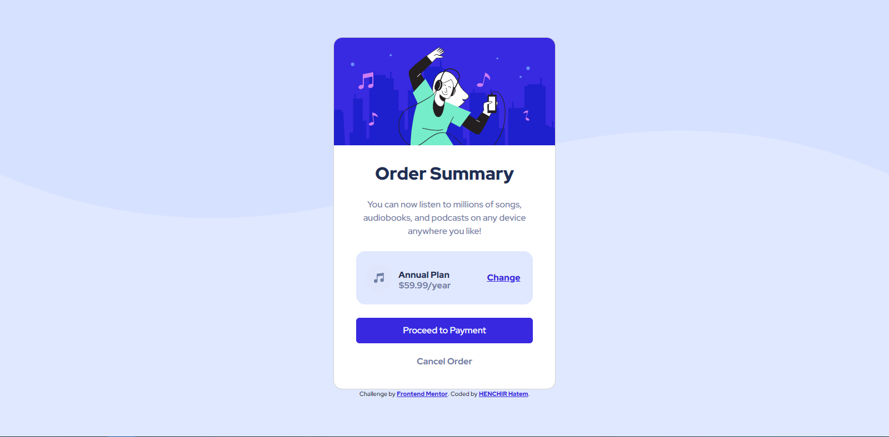

# Frontend Mentor - Order summary card solution

This is a solution to the [Order summary card challenge on Frontend Mentor](https://www.frontendmentor.io/challenges/order-summary-component-QlPmajDUj).
## Table of contents

- [Overview](#overview)
  - [The challenge](#the-challenge)
  - [Screenshot](#screenshot)
  - [Links](#links)
- [My process](#my-process)
  - [Built with](#built-with)
  - [Continued development](#continued-development)
- [Author](#Author)

## Overview

### The challenge

Building out a very simple order summary card using HTML + CSS.

Users should be able to:

- See a responsive design that adapts to the size of their viewport
- See hover states for interactive elements (buttons, links)

### Screenshot
#### Desktop

#### Mobile

### Links

- Solution URL: [GitHub repo](https://github.com/hatemhenchir/Order-summary-card)
- Live Site URL: [Live site](https://hatemhenchir.github.io/Order-summary-card/)

## My process

### Built with

- Semantic HTML5 markup
- CSS custom properties
- Flexbox
- Bootstrap 5

### Continued development

Will do more of these challenges to improve my skills.

## Author
- Frontend Mentor - [@hatemhenchir](https://www.frontendmentor.io/profile/hatemhenchir)
- Linkedin - [@hatem-henchir-7a92141a8](https://www.linkedin.com/in/hatem-henchir-7a92141a8/)
